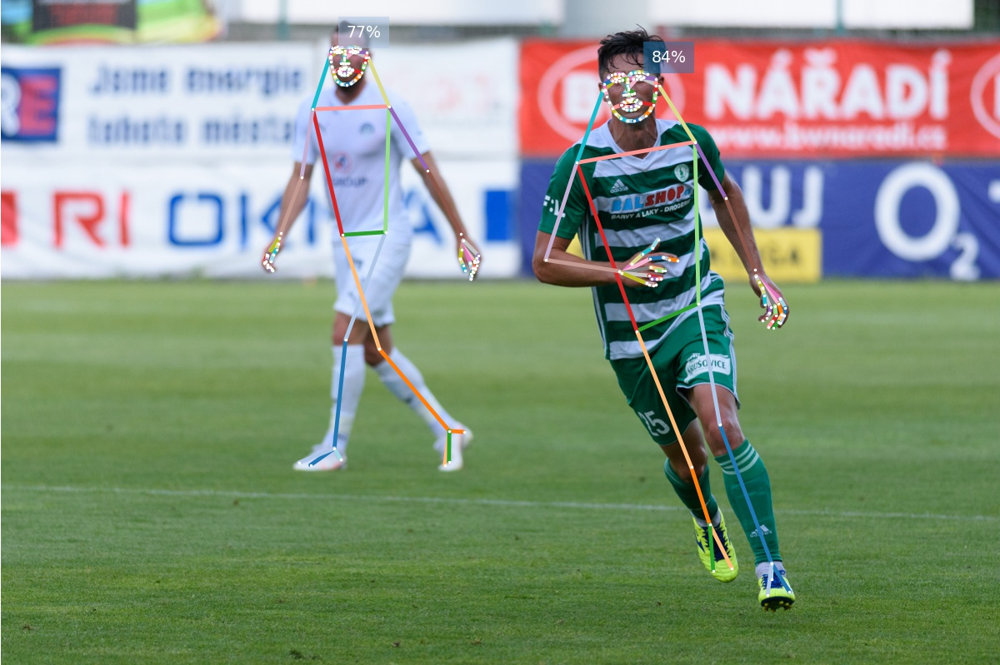
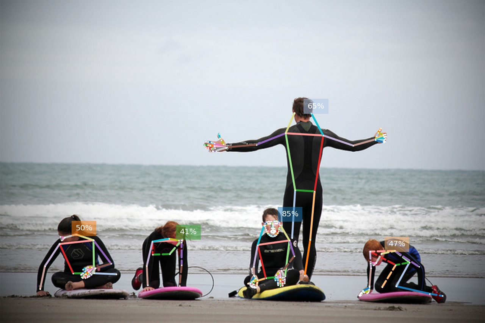
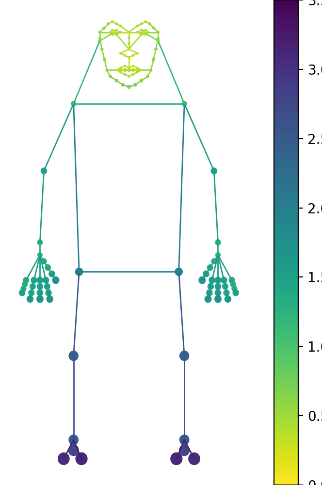
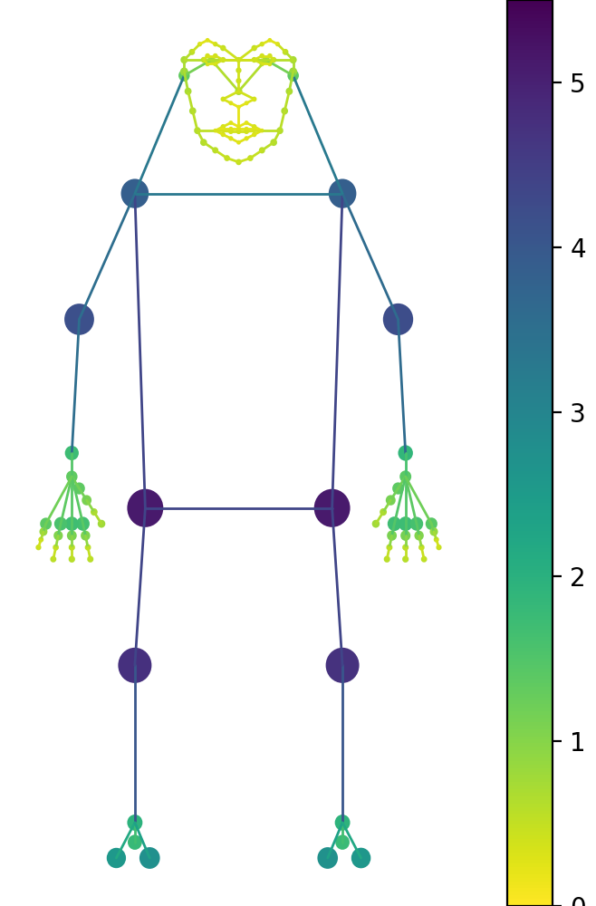

# Keypoint_Communities
In this repository you will find the code to our [ICCV '21 paper](https://arxiv.org/abs/2110.00988):
> __Keypoint Communities__<br />
> _[Duncan Zauss](https://www.linkedin.com/in/duncan-zauss/), [Sven Kreiss](https://www.svenkreiss.com), [Alexandre Alahi](https://scholar.google.com/citations?user=UIhXQ64AAAAJ&hl=en)_, 2021.
>
> We present a fast bottom-up method that jointly detects over 100 keypoints on humans or objects, also referred to as human/object pose estimation. We model all keypoints belonging to a human or an object -- the pose -- as a graph and leverage insights from community detection to quantify the independence of keypoints. We use a graph centrality measure to assign training weights to different parts of a pose. Our proposed measure quantifies how tightly a keypoint is connected to its neighborhood. Our experiments show that our method outperforms all previous methods for human pose estimation with fine-grained keypoint annotations on the face, the hands and the feet with a total of 133 keypoints. We also show that our method generalizes to car poses. 



Image credit: [Photo](https://de.wikipedia.org/wiki/Kamil_Vacek#/media/Datei:Kamil_Vacek_20200627.jpg) by [Lokomotive74](https://commons.wikimedia.org/wiki/User:Lokomotive74) which is licensed under [CC-BY-4.0](https://creativecommons.org/licenses/by/4.0/).<br />
Created with:
```sh
python -m openpifpaf.predict docs/soccer.jpeg --checkpoint=shufflenetv2k30-wholebody --line-width=2 --show
```



Image credit: "[Learning to surf](https://www.flickr.com/photos/fotologic/6038911779/in/photostream/)" by fotologic which is licensed under [CC-BY-2.0].<br />
Created with:
```sh
python3 -m openpifpaf.predict docs/000000081988.jpg --checkpoint=shufflenetv2k30-wholebody --line-width=2 --show
```
 

## Installation
This project is based on [openpifpaf](https://github.com/openpifpaf/openpifpaf). Create a virtual environment with python 3.7, 3.8 or 3.9, clone this repo and then install the required packages:
```
git clone https://github.com/DuncanZauss/Keypoint_Communities.git
cd Keypoint_Communities
pip install -r requirements.txt
```

## Obtain keypoint weights
To compute the keypoint weights with our method, download the preprocessed annotations of the [MS COCO WholeBody dataset](https://github.com/jin-s13/COCO-WholeBody) and/or the [ApolloCar3D dataset](http://apolloscape.auto/car_instance.html) with the following commands:
```
cd Keypoint_Communities/src
wget https://github.com/DuncanZauss/Keypoint_Communities/releases/download/v0.1.0/person_keypoints_train2017_wholebody_pifpaf_style.json
wget https://github.com/DuncanZauss/Keypoint_Communities/releases/download/v0.1.0/apollo_keypoints_66_train.json
```
To compute the average euclidean distance in the datasets for every edge run:
```
python Compute_edge_weights.py
```
To compute training weights with centrality measures as proposed in our paper run the following command:
```
python Compute_edge_weights.py
```
You will find the computed weights in the respective csv file and a visualization of the computed weights in the respective docs folder.
<p float="left">
  
   
</p>
Visualization of the weights for the WholeBody pose, where take all shortest paths into account (left) and where we only take shortest paths with a radius of three into account (right).


## Training
For training you will need to download the MS COCO dataset and the WholeBody keypoint annotations as explained [here](https://openpifpaf.github.io/plugins_wholebody.html#train).
To train an OpenPifPaf model with our keypoint weighting scheme, you can use the following command:
```
python -m openpifpaf.train --dataset=wholebody --lr=0.0001 --momentum=0.95 --b-scale=10.0 --clip-grad-value=10 --epochs=350 --lr-decay 330 340 --lr-decay-epochs=10 --lr-warm-up-start-epoch=250 --batch-size=16 --weight-decay=1e-5 --wholebody-upsample=2 --wholebody-extended-scale --wholebody-orientation-invariant=0.1 --checkpoint=shufflenetv2k30 --head-consolidation=create --wholebody-val-annotations=<dataset_path>/person_keypoints_val2017_wholebody_pifpaf_style.json --wholebody-train-annotations=<dataset_path>/person_keypoints_train2017_wholebody_pifpaf_style.json --wholebody-apply-local-centrality-weights
```

## Evaluation
To evaluate a trained model you first need to download the annotation file from [this link](https://drive.google.com/file/d/1N6VgwKnj8DeyGXCvp1eYgNbRmw6jdfrb/view) and than you can use the following command to evaluate a model:
```
python -m openpifpaf.eval --dataset=wholebody --checkpoint=shufflenetv2k30-wholebody --force-complete-pose --seed-threshold=0.2 --force-complete-caf-th=0.001  --wholebody-val-annotations=<dataset_path>/coco_wholebody_val_v1.0.json
```
The `shufflenetv2k30-wholebody` is our pretrained model, which was trained with the command from the [Training section](https://github.com/DuncanZauss/Keypoint_Communities#training) and will automatically be downloaded via torchhub. If you wish to evaluate your own model you can replace it with a local path to your model.

