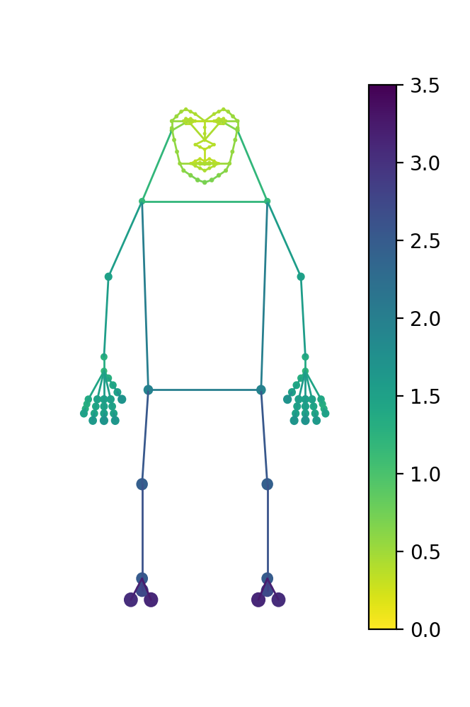
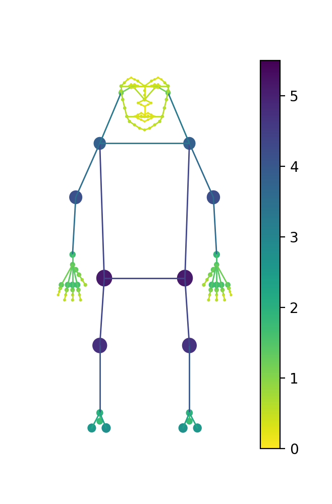
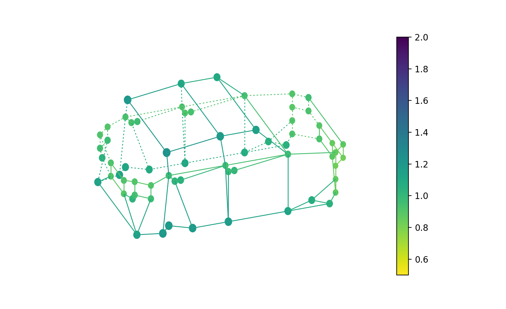
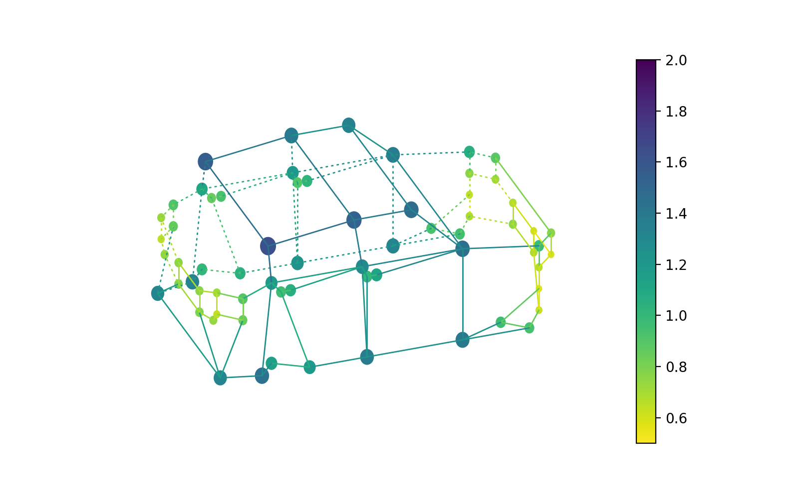

# Keypoint_Communities
In this repository you will find the code to our [paper](TODO):
> __Keypoint Communities__ 
> _[Duncan Zauss](https://www.linkedin.com/in/duncan-zauss/), [Sven Kreiss](https://www.svenkreiss.com), [Alexandre Alahi](https://scholar.google.com/citations?user=UIhXQ64AAAAJ&hl=en)_, 2021.
>
> We present a generic method to
> learn coarse and fine-grained pose details with a single neural network.
> Our proposed method leverages insights from community detection in graphs
> to quantify independence of keypoints.
> We model the collection of keypoints --pose-- as a graph and use graph centrality measures to assign
> training weights to different parts of a pose.
> For graph centrality, we compute the average length of all shortest paths of a
> keypoint to all other keypoints
> to quantify how tightly connected that keypoint is in the pose. We then train with
> a weighted objective to optimize that all keypoints are equally well connected.
> For our experiments, we use an off-the-shelf bottom-up pose estimator based
> on Composite Fields.
> Our experiments show that our method outperforms all previous methods for
> human pose estimation with fine-grained keypoint annotations on the face, the hands
> and the feet with a total of 133 keypoints.
> We show that our method generalizes to car poses with 66 keypoints as well. 

## Obtain keypoint weights

## Training

## Evaluation

TODO: Add short explanation, add paper link

