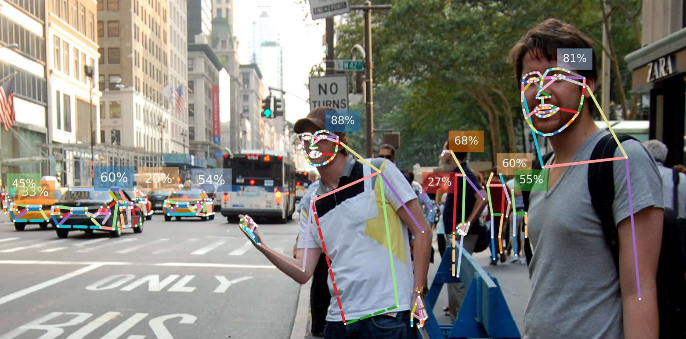
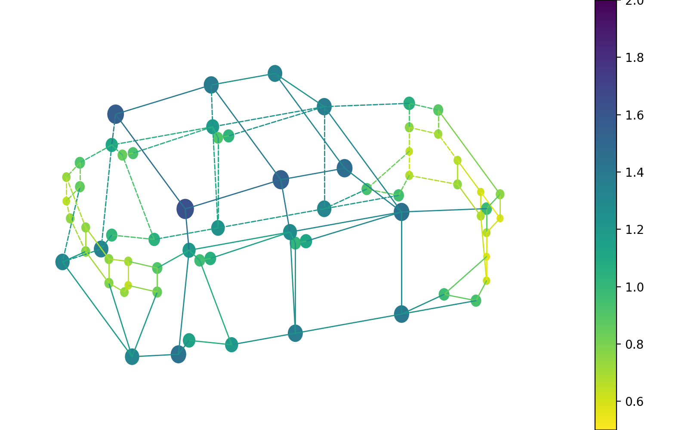
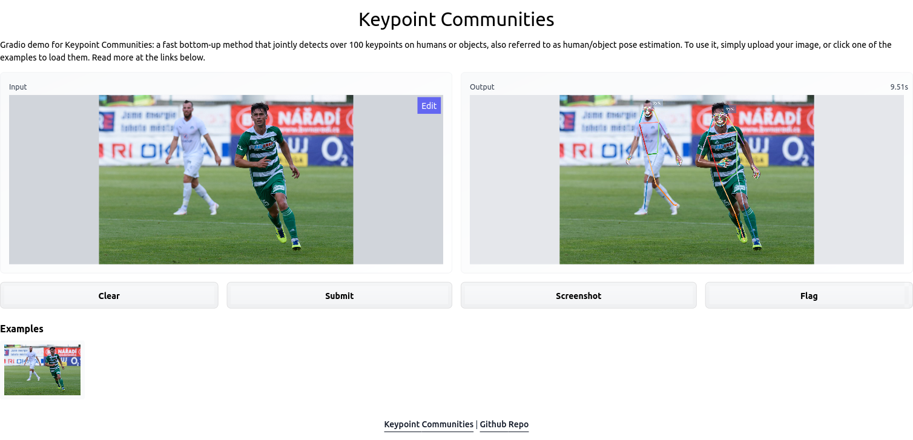

# Keypoint Communities
[](https://paperswithcode.com/sota/2d-human-pose-estimation-on-coco-wholebody-1?p=keypoint-communities)
[](https://paperswithcode.com/sota/car-pose-estimation-on-apollocar3d?p=keypoint-communities)

In this repository you will find the code to our [ICCV '21 paper](https://openaccess.thecvf.com/content/ICCV2021/html/Zauss_Keypoint_Communities_ICCV_2021_paper.html):
> __Keypoint Communities__<br />
> _[Duncan Zauss](https://www.linkedin.com/in/duncan-zauss/), [Sven Kreiss](https://www.svenkreiss.com), [Alexandre Alahi](https://scholar.google.com/citations?user=UIhXQ64AAAAJ&hl=en)_, 2021.
>
> We present a fast bottom-up method that jointly detects over 100 keypoints on humans or objects, also referred to as human/object pose estimation. We model all keypoints belonging to a human or an object -the pose- as a graph and leverage insights from community detection to quantify the independence of keypoints. We use a graph centrality measure to assign training weights to different parts of a pose. Our proposed measure quantifies how tightly a keypoint is connected to its neighborhood. Our experiments show that our method outperforms all previous methods for human pose estimation with fine-grained keypoint annotations on the face, the hands and the feet with a total of 133 keypoints. We also show that our method generalizes to car poses. 

## Qualitative results



Image credit: [Photo](https://www.flickr.com/photos/mrlerone/3966487577/in/photolist-73vhyR-M9mY) by Toby Bradbury which is licensed under [CC-BY-2.0](https://creativecommons.org/licenses/by/2.0/).<br />


Demo of a short [video](https://www.youtube.com/watch?v=0iKFgEPOk20) that we have processed with our human pose estimation network and the car pose estimation network.


Webcam demo. You can try it out yourself with the following command: 
```sh
python -m openpifpaf.video --source=0 --checkpoint=shufflenetv2k16-wholebody --long-edge=321 --horizontal-flip --show
```
You can replace ```--source=0``` with ```--source=<PathToMyVideo>/videofile.mp4``` if you wish to process a video file instead of using your webcam.
<br />


Image credit: [Photo](https://de.wikipedia.org/wiki/Kamil_Vacek#/media/Datei:Kamil_Vacek_20200627.jpg) by [Lokomotive74](https://commons.wikimedia.org/wiki/User:Lokomotive74) which is licensed under [CC-BY-4.0](https://creativecommons.org/licenses/by/4.0/).<br />
Created with:
```sh
python -m openpifpaf.predict docs/soccer.jpeg --checkpoint=shufflenetv2k30-wholebody --line-width=2 --show
```


Image credit: "[Learning to surf](https://www.flickr.com/photos/fotologic/6038911779/in/photostream/)" by fotologic which is licensed under [CC-BY-2.0].<br />
Created with:
```sh
python3 -m openpifpaf.predict docs/000000081988.jpg --checkpoint=shufflenetv2k30-wholebody --line-width=2 --show
```
 


Example prediction on one of the validation images \(180310\_022316798\_Camera\_5.jpg\) of the [ApolloCar3D dataset](http://apolloscape.auto/car_instance.html).
Created with:
```sh
python -m openpifpaf.predict <Path/To/The/ApolloCar3D/Images>/180310_022316798_Camera_5.jpg --checkpoint=shufflenetv2k30-apollo-66 --image-dpi-factor=0.25 --line-width=2 --caf-th=0.2 --seed-threshold=0.2 --show
```

## Installation
This project is based on [OpenPifPaf](https://github.com/openpifpaf/openpifpaf). Create a virtual environment with python 3.7, 3.8 or 3.9, clone this repo and then install the required packages:
```
git clone https://github.com/DuncanZauss/Keypoint_Communities.git
cd Keypoint_Communities
pip install -r requirements.txt
```

## Obtain keypoint weights
To compute the keypoint weights with our method, download the preprocessed annotations of the [MS COCO WholeBody dataset](https://github.com/jin-s13/COCO-WholeBody) and/or the [ApolloCar3D dataset](http://apolloscape.auto/car_instance.html) with the following commands:
```
cd Keypoint_Communities/src
wget https://github.com/DuncanZauss/Keypoint_Communities/releases/download/v0.1.0/person_keypoints_train2017_wholebody_pifpaf_style.json
wget https://github.com/DuncanZauss/Keypoint_Communities/releases/download/v0.1.0/apollo_keypoints_66_train.json
```
To compute the average euclidean distance in the datasets for every edge run:
```
python Compute_edge_weights.py
```
To compute training weights with centrality measures as proposed in our paper run the following command:
```
python Compute_training_weights.py
```
You will find the computed weights in the respective csv file and a visualization of the computed weights in the respective docs folder.
<p float="left">
  
   
</p>
Visualization of the weights for the WholeBody, where we take all shortest paths into account (left) and where we only take the shortest paths with a radius of three into account (right).

Visualization of the weights for the car pose, where we only take the shortest paths with a radius of three into account.

## Training
For training you will need to download the MS COCO dataset and the WholeBody keypoint annotations as explained [here](https://openpifpaf.github.io/plugins_wholebody.html#train).
To train an OpenPifPaf model with our keypoint weighting scheme, you can use the following command:
```
python -m openpifpaf.train --dataset=wholebody --lr=0.0001 --momentum=0.95 --b-scale=10.0 --clip-grad-value=10 --epochs=350 --lr-decay 330 340 --lr-decay-epochs=10 --lr-warm-up-start-epoch=250 --batch-size=16 --weight-decay=1e-5 --wholebody-upsample=2 --wholebody-extended-scale --wholebody-orientation-invariant=0.1 --checkpoint=shufflenetv2k30 --head-consolidation=create --wholebody-val-annotations=<dataset_path>/person_keypoints_val2017_wholebody_pifpaf_style.json --wholebody-train-annotations=<dataset_path>/person_keypoints_train2017_wholebody_pifpaf_style.json --wholebody-apply-local-centrality-weights
```

## Evaluation
To evaluate a trained model you first need to download the annotation file from [this link](https://drive.google.com/file/d/1N6VgwKnj8DeyGXCvp1eYgNbRmw6jdfrb/view) and than you can use the following command to evaluate a model:
```
python -m openpifpaf.eval --dataset=wholebody --checkpoint=shufflenetv2k30-wholebody --force-complete-pose --seed-threshold=0.2 --force-complete-caf-th=0.001  --wholebody-val-annotations=<dataset_path>/coco_wholebody_val_v1.0.json
```
The command should return you the following metrics:
|                   |  WB  | body | foot | face | hand |
|-------------------|:----:|:----:|:----:|:----:|:----:|
| AP                | **60.4** | **69.6** | **63.4** | **85.0** | **52.9** |
| AP<sup>0.5</sup>  | 85.5 | 88.1 | 80.0 | 95.4 | 78.5 |
| AP<sup>0.75</sup> | 66.2 | 76.1 | 68.0 | 89.2 | 57.7 |
| AP<sup>M</sup>    | 47.4 | 57.7 | 46.0 | 57.4 | 18.0 |
| AP<sup>L</sup>    | 67.8 | 77.5 | 71.4 | 92.4 | 57.0 |

Additionally the runtime for the network and decoder is shown. For our setup \(GPU: NVIDIA GTX 1080Ti, CPU: Intel i7-8700\) the neural network runs in 93ms and the decoder runs in 60ms. Additional decoder settings for different precision/inference time trade-offs are shown in table 4 of our [paper](https://openaccess.thecvf.com/content/ICCV2021/html/Zauss_Keypoint_Communities_ICCV_2021_paper.html).

The `shufflenetv2k30-wholebody` is our pretrained model, which was trained with the command from the [Training section](https://github.com/DuncanZauss/Keypoint_Communities#training) and will automatically be downloaded via torchhub. If you wish to evaluate your own model you can replace it with a local path to your model.

## Related projects
* [AK391](https://github.com/AK391) created a great webdemo in [Huggingface Spaces](https://huggingface.co/spaces) with [Gradio](https://github.com/gradio-app/gradio). See demo: [](https://huggingface.co/spaces/akhaliq/Keypoint_Communities)


## Citation
If you find our research useful we would be happy if you cite us:
```
@inproceedings{zauss2021keypoint,
  title={Keypoint Communities},
  author={Zauss, Duncan and Kreiss, Sven and Alahi, Alexandre},
  booktitle={Proceedings of the IEEE/CVF International Conference on Computer Vision},
  pages={11057--11066},
  year={2021}
}
```

## License
The code in this repository is licensed under the MIT license. For more information please refer to the LICENSE file. This project is largely based on [OpenPifPaf](https://github.com/openpifpaf/openpifpaf). OpenPifPaf is licensed under the GNU AGPLv3 license, for more information please refer to [OpenPifPaf's license](https://github.com/openpifpaf/openpifpaf/blob/main/LICENSE).

